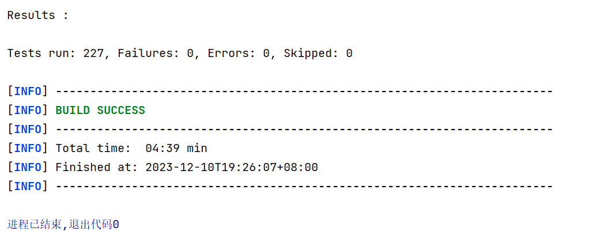

## 背景

- 课程：[6.830/6.814: Database Systems](http://db.lcs.mit.edu/6.5830/2021/assign.php)
- Lab：[simple-db-hw-2021](https://github.com/MIT-DB-Class/simple-db-hw-2021)

## 实现说明
- 添加了中文文档
- 将项目改为使用maven构建
- master分支下为实验源代码，dev分支下为自己实现代码
- 具体实现过程可见博客：http://www.hyeee.me/2023/10/15/SimpleDB%E9%A1%B9%E7%9B%AE%E6%80%BB%E8%A7%88/
- github链接：https://github.com/0Heeee/SimpleDB/
- 所有测试均通过：



## SimpleDB 项目总览

### 1. 组成部分

- 代表字段（fields）、元组（tuples）和元组模式（tuple schemas）的类。
- 对Tuple应用谓词和条件的类。
- 一个或多个访问方法（例如，堆文件），能够将关系存储在磁盘上，并可以遍历这些关系的Tuple。
- 一个操作者类的集合（例如，选择、连接、插入、删除等），用于处理Tuple。
- 一个缓冲池，用于缓存内存中的active Tuple和Page，并且处理并发控制和事务（在实验1中不需要担心这两点）。
- 一个 catalog ，用于存储关于可用表和它们的模式的信息。
- （在实验1中不包含）SQL前端或分析器
    - SQL前端或分析器能够允许你直接向SimpleDB输入查询
    - SimpleDB的查询是通过将一组运算符串联到一个手工建立的查询计划中来建立的。SimpleDB中已经提供了一个简单的解析器，在后面的实验中使用。

- （在实验1中不包含）查询优化器
- （在实验1中不包含）索引

### 2. 不包含的部分

- 视图（Views）
- 除了整数和固定长度的字符串以外的数据类型

### 3. Database类

Database类提供了对静态对象集合的访问，这些对象是数据库的全局状态。

特别是，这包括访问 catalog （数据库中所有表的列表）、缓冲池（当前驻留在内存中的数据库文件页的集合）和日志文件的方法。

在实验1中不需要担心日志文件的问题，Database类中已经实现完成了相关方法。

### 4. Field 和 Tuple

SimpleDB中的Tuple是非常基本的。 它们由Field的集合组成，由一组字段（Filed）组成，每个字段对应一个元组。

Field是一个接口，不同的数据类型（如整数、字符串）实现了该接口。Tuple对象是由底层访问方法（如堆文件或B树）创建的。Tuple还具有称为元组描述符（Tuple Descriptor）的类型（或模式），由TupleDesc对象表示。该对象由一组Type对象组成，每个字段对应一个Type对象，每个Type对象描述了相应字段的类型。

### 5. Catalog类

Catalog类包含当前数据库中的表和表的模式列表。每个表都关联一个TupleDesc对象，使操作者能够确定表中字段的类型和数量。全局目录是Catalog的一个单一实例，为整个SimpleDB进程分配。可以通过方法Database.getCatalog()获取全局目录，全局缓冲池也是如此（使用Database.getBufferPool()）。

### 6. BufferPool类

BufferPool类负责将最近从磁盘读取的页面缓存到内存中。所有操作符通过缓冲池从磁盘上的各个文件读取和写入页面。缓冲池由固定数量的页面组成，这个数量由BufferPool构造函数的numPages定义。后续实验中将会实现一种淘汰页面的策略。

在实验1中，只需要实现构造函数和SeqScan操作符使用的BufferPool中的getPage()方法。BufferPool应该最多存储numPages个页面。在实验1中，如果请求了超过numPages个不同页面的请求，您可以抛出DbException，而无需实现淘汰页面策略。Database类提供了一个静态方法Database.getBufferPool()，用于返回整个SimpleDB进程的单个BufferPool实例的引用。

### 7. HeapFile 和 HeapPage

HeapFile访问方法提供了一种按特定方式从磁盘读取或写入数据的方式。常见的访问方法包括堆文件（未排序的Tuple文件）和B树。

HeapFile对象被组织成一组页面，每个页面包含一定数量的字节用于存储元组（由常量BufferPool.DEFAULT_PAGE_SIZE定义），包括一个头部。在SimpleDB中，每个表在数据库中都有一个HeapFile对象。HeapFile中的每个页面都被组织成一组槽位（slots），每个槽位可以容纳一个元组（SimpleDB中给定表的元组大小相同）。除了这些槽位之外，每个页面还有一个头部，其中包含一个位图，每个元组槽位对应一个位。如果位图中特定元组对应的位为1，则表示该元组是有效的；如果为0，则表示该元组无效（例如已被删除或从未初始化）。HeapFile对象的页面的类型是HeapPage，它实现了Page接口。页面存储在缓冲池中，但由HeapFile类进行读取和写入操作。

SimpleDB将堆文件以几乎相同的格式存储在磁盘上，就像它们在内存中存储的方式一样。每个文件在磁盘上连续排列的页面数据组成。每个页面由表示头部的一个或多个字节组成，后跟实际页面内容的页面大小字节。每个元组需要元组大小 * 8 位用于其内容，并且需要 1 位用于头部。因此，单个页面可以容纳的元组数量为：

*tuples per page* = floor((*page size* * 8) / (*tuple size* * 8 + 1))

其中，元组大小是页面中元组的大小（以字节为单位）。这里的想法是每个元组在头部需要额外的一位存储空间。我们通过将页面大小乘以8来计算页面中的位数，并将这个数量除以元组中的位数（包括这个额外的头部位），从而得到每个页面的元组数量。floor操作将结果向下取整，得到最接近整数的元组数量。

一旦知道了每个页面的元组数量，存储头部所需的字节数就简单了：

*headerBytes* = ceiling(*tuples per page* / 8)

ceiling操作将结果向上取整，得到最接近整数的字节数。

每个字节的低位（最低有效位）表示文件中较早的槽位的状态。因此，第一个字节的最低位表示页面中的第一个槽位是否正在使用。第一个字节的第二个最低位表示页面中的第二个槽位是否正在使用，依此类推。此外，请注意最后一个字节的高位可能不对应实际存在于文件中的槽位，因为槽位的数量可能不是8的倍数。还请注意，所有的Java虚拟机都是大端序（big-endian）的。

### 8. Operators

操作符负责执行查询计划的实际操作。它们实现了关系代数的操作。在SimpleDB中，操作符是基于迭代器的，每个操作符都实现了DbIterator接口。

将低级操作符传递到高级操作符的构造函数中，就能够连接操作符。叶子节点处的特殊访问方法操作符负责从磁盘读取数据（因此它们下面没有任何操作符）。

查询计划开始执行时，与SimpleDB交互的程序只需调用根操作符的getNext方法。然后，该操作符调用其子操作符的getNext方法，依此类推，直到调用这些叶子操作符。它们从磁盘获取元组并将其传递给上层的操作符（作为getNext方法的返回参数）。元组以这种方式按照查询计划向上传播，直到在根部输出或与另一个操作符组合（或拒绝）。在实验1中，只需要实现一个SimpleDB操作符。

### 9. A simple query

本节的目的是说明这些不同组件如何连接在一起来处理一个简单的查询。假设你有一个名为"some_data_file.txt"的数据文件，其内容如下：

```txt
1,1,1

2,2,2 

3,4,4
```

你可以将其转换为SimpleDB可以查询的二进制文件，方法如下所示：

```bash
java -jar dist/simpledb.jar convert some_data_file.txt 3
```

这里，参数"3"告诉conver输入有3列。

以下代码实现了对该文件的简单选择查询：

```java
package simpledb;
import java.io.*;

public class test {

    public static void main(String[] argv) {

        // construct a 3-column table schema
        Type types[] = new Type[]{ Type.INT_TYPE, Type.INT_TYPE, Type.INT_TYPE };
        String names[] = new String[]{ "field0", "field1", "field2" };
        TupleDesc descriptor = new TupleDesc(types, names);

        // create the table, associate it with some_data_file.dat
        // and tell the catalog about the schema of this table.
        HeapFile table1 = new HeapFile(new File("some_data_file.dat"), descriptor);
        Database.getCatalog().addTable(table1, "test");

        // construct the query: we use a simple SeqScan, which spoonfeeds
        // tuples via its iterator.
        TransactionId tid = new TransactionId();
        SeqScan f = new SeqScan(tid, table1.getId());

        try {
            // and run it
            f.open();
            while (f.hasNext()) {
                Tuple tup = f.next();
                System.out.println(tup);
            }
            f.close();
            Database.getBufferPool().transactionComplete(tid);
        } catch (Exception e) {
            System.out.println ("Exception : " + e);
        }
    }

}
```

以上这段代码相当于SQL语句：

```sql
SELECT * FROM some_data_file
```

我们创建的表具有三个整数字段。为了表示这一点，我们创建了一个TupleDesc对象，并传递给它一个Type对象的数组，以及一个可选的String字段名数组。创建了这个TupleDesc之后，我们初始化了一个表示存储在some_data_file.dat中的表的HeapFile对象。创建完表之后，将其添加到目录中。如果这是一个已经在运行的数据库服务器，那么目录信息已经加载。为了使这段代码自包含（self-contained），我们需要显式地加载它。

一旦初始化了数据库系统，我们就创建一个查询计划。我们的计划只包含从磁盘扫描元组的SeqScan操作符。通常情况下，这些操作符的实例化需要引用相应的表（对于SeqScan来说）或通过子操作符引用（对于例如Filter）。然后，测试程序会重复调用SeqScan操作符的hasNext和next方法。当元组从SeqScan中输出时，它们会在命令行上打印出来。

我们强烈建议你尝试这个有趣的端到端测试，这将帮助你获得编写自己的SimpleDB测试程序的经验。你应该在src/java/simpledb目录下创建一个名为"test.java"的文件，其中包含上述代码，并在代码上方添加一些"import"语句，将some_data_file.dat文件放在顶级目录中，然后运行该测试。


## 使用maven构建项目

- 根据搜索引擎以及[MIT 6.830 数据库系统](https://gitee.com/DaHuYuXiXi/simple-db-hw-2021)的实现，将ant构建项目改为maven构建，需要实现两步：
    - 迁移源代码
        - 源代码位于src/main/java
        - 资源文件位于src/main/resources
        - 测试代码位于src/test/java
        - 测试资源文件位于src/test/resources

    - 添加pom.xml文件
        - 根据build.xml（ant配置文件）来添加依赖和插件

- 出现报错
    - `Could not find artifact org.apache.mina:mina-core:bundle:2.0.7 in nexus-aliyun...`
    - 查阅不到相关内容，根据报错信息猜测查找不到需要的依赖，推测是之前修改中央仓库为阿里云
    - 查找maven配置文件settings.xml，添加中央仓库，重启IDEA（又重启了电脑），最终成功构建


## 项目解析

- Field是数据类型，SimpleDB中只有两种数据类型：整数类型和定长字符串。因此确定了表的结构之后，每个元组的长度是固定的。
- TupleDesc是元组描述，包括tdItemList。List中的每个元素都是TDItem类型，存储各个field的类型与名称。
- Tuple是元组，也就是单条记录。包括元组描述td，记录编号rid和存储具体数据的fieldList。
- Catalog中存储当前数据库的表。对于SimpleDB，只有一个全局Catalog。
- BufferPool是缓冲池，存储固定数量的Page。对于SimpleDB，只有一个全局BufferPool。
- DbFile是表述单张表的数据结构，能够获取到表在磁盘上存储的具体Pages，并且遍历表的元组。每个DbFile都是通过缓存池获取。
    - 在SimpleDB中，表用数据结构DbFile表示，表中的数据存储在Page上，每个PageId对应一个Page。BufferPool的设计类似于cache，将一部分Page存储在内存中，其余存储在磁盘上。这种设计能在存储速度和存储空间上都较优。当PageId对应的Page不在BufferPool中时，从磁盘中读取对应的Page，并加入到BufferPool中。若BufferPool已满，则需要淘汰Page（采用淘汰策略决定被淘汰的Page，如最近最久未使用等），然后将新读入的Page放在被淘汰的Page的位置。因此，BufferPool中需要映射集合，将PageId映射到BPageId（BPageId是Page在BufferPool中的位置，通过BPageId能够直接在BufferPool中获取到Page）。
    - HeapFile实现了接口DbFile。

- HeapPage实现了接口Page，是用堆文件的方式存储Tuple。包括PageId pid，Tuple描述td、指明当前位置是否为空的header（类似位图）、Tuple集合tuples、槽位数量numSlots，还有用于恢复数据的oldData和oldDataLock。
- RecordID包括两部分：PageId和tupleNumber。
    - PageId是个接口，说明所在的Page。例如HeapPageId中只需包含两个变量，tableId和pageNumber，说明该Page位于哪张表的哪一页上。
    - tupleNumber说明是该页的第几个元组。